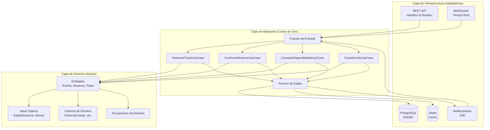
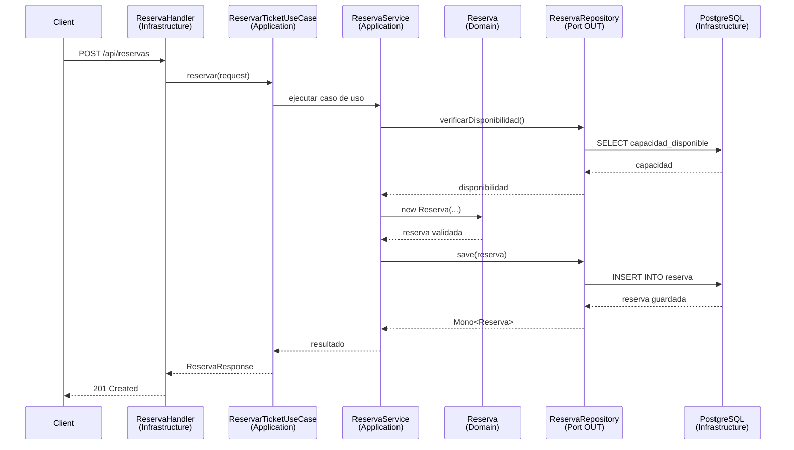
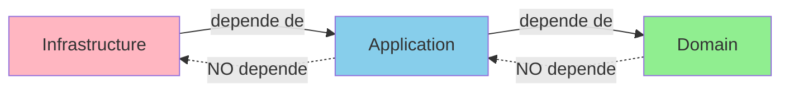

# 🏗️ Arquitectura del Sistema

## Arquitectura Hexagonal (Clean Architecture)

El proyecto sigue los principios de Clean Architecture de Robert C. Martin, implementando una arquitectura hexagonal con separación clara de responsabilidades.

## Diagrama de Capas



## Estructura de Carpetas Detallada

```
event-booking-system/
├── src/
│   ├── main/
│   │   ├── java/com/tuusuario/eventbooking/
│   │   │   │
│   │   │   ├── domain/                          # ⭐ CAPA DE DOMINIO
│   │   │   │   │                                # Lógica de negocio pura
│   │   │   │   │                                # Sin dependencias externas
│   │   │   │   │
│   │   │   │   ├── model/                       # Entidades y Value Objects
│   │   │   │   │   ├── Evento.java              # Agregado raíz
│   │   │   │   │   ├── Zona.java                # Entidad
│   │   │   │   │   ├── Ticket.java              # Entidad
│   │   │   │   │   ├── Reserva.java             # Agregado raíz
│   │   │   │   │   ├── Usuario.java             # Agregado raíz
│   │   │   │   │   ├── Pago.java                # Entidad
│   │   │   │   │   └── vo/                      # Value Objects (inmutables)
│   │   │   │   │       ├── EstadoReserva.java   # Enum
│   │   │   │   │       ├── EstadoEvento.java    # Enum
│   │   │   │   │       ├── TipoPago.java        # Enum
│   │   │   │   │       └── Money.java           # Value Object
│   │   │   │   │
│   │   │   │   ├── exception/                   # Excepciones de dominio
│   │   │   │   │   ├── ReservaException.java
│   │   │   │   │   ├── TicketNoDisponibleException.java
│   │   │   │   │   ├── EventoNoEncontradoException.java
│   │   │   │   │   └── PagoFallidoException.java
│   │   │   │   │
│   │   │   │   └── event/                       # Eventos de dominio
│   │   │   │       ├── DomainEvent.java         # Interface base
│   │   │   │       ├── ReservaCreada.java
│   │   │   │       ├── ReservaConfirmada.java
│   │   │   │       ├── ReservaExpirada.java
│   │   │   │       └── TicketVendido.java
│   │   │   │
│   │   │   ├── application/                     # ⭐ CAPA DE APLICACIÓN
│   │   │   │   │                                # Casos de uso y orquestación
│   │   │   │   │                                # Define PUERTOS (interfaces)
│   │   │   │   │
│   │   │   │   ├── port/
│   │   │   │   │   ├── in/                      # Puertos de entrada
│   │   │   │   │   │   │                        # Interfaces que expone la app
│   │   │   │   │   │   ├── ReservarTicketUseCase.java
│   │   │   │   │   │   ├── ConfirmarReservaUseCase.java
│   │   │   │   │   │   ├── CancelarReservaUseCase.java
│   │   │   │   │   │   ├── ConsultarDisponibilidadUseCase.java
│   │   │   │   │   │   ├── CrearEventoUseCase.java
│   │   │   │   │   │   ├── ActualizarEventoUseCase.java
│   │   │   │   │   │   └── ListarEventosUseCase.java
│   │   │   │   │   │
│   │   │   │   │   └── out/                     # Puertos de salida
│   │   │   │   │       │                        # Interfaces que la app necesita
│   │   │   │   │       ├── ReservaRepository.java
│   │   │   │   │       ├── EventoRepository.java
│   │   │   │   │       ├── TicketRepository.java
│   │   │   │   │       ├── UsuarioRepository.java
│   │   │   │   │       ├── PagoRepository.java
│   │   │   │   │       ├── NotificationService.java
│   │   │   │   │       └── EventPublisher.java
│   │   │   │   │
│   │   │   │   ├── service/                     # Implementación de casos de uso
│   │   │   │   │   ├── ReservaService.java      # Implementa ReservarTicketUseCase
│   │   │   │   │   ├── EventoService.java       # Implementa CrearEventoUseCase
│   │   │   │   │   ├── DisponibilidadService.java
│   │   │   │   │   └── PagoService.java
│   │   │   │   │
│   │   │   │   ├── dto/                         # DTOs de aplicación
│   │   │   │   │   │                            # Para transferencia de datos
│   │   │   │   │   ├── ReservaRequest.java
│   │   │   │   │   ├── ReservaResponse.java
│   │   │   │   │   ├── EventoRequest.java
│   │   │   │   │   ├── EventoResponse.java
│   │   │   │   │   ├── DisponibilidadResponse.java
│   │   │   │   │   └── PagoRequest.java
│   │   │   │   │
│   │   │   │   └── validation/
│   │   │   │       └── ObjectValidator.java
│   │   │   │
│   │   │   └── infrastructure/                  # ⭐ CAPA DE INFRAESTRUCTURA
│   │   │       │                                # Adaptadores e implementaciones
│   │   │       │                                # Detalles técnicos
│   │   │       │
│   │   │       ├── adapter/
│   │   │       │   │
│   │   │       │   ├── in/                      # Adaptadores de ENTRADA
│   │   │       │   │   │                        # Implementan puertos IN
│   │   │       │   │   │
│   │   │       │   │   ├── rest/                # REST API (WebFlux)
│   │   │       │   │   │   ├── handler/
│   │   │       │   │   │   │   ├── EventoHandler.java
│   │   │       │   │   │   │   ├── ReservaHandler.java
│   │   │       │   │   │   │   ├── DisponibilidadHandler.java
│   │   │       │   │   │   │   └── UsuarioHandler.java
│   │   │       │   │   │   └── router/
│   │   │       │   │   │       └── RouterConfig.java
│   │   │       │   │   │
│   │   │       │   │   └── websocket/           # WebSocket para tiempo real
│   │   │       │   │       ├── DisponibilidadWebSocketHandler.java
│   │   │       │   │       ├── NotificacionWebSocketHandler.java
│   │   │       │   │       └── WebSocketConfig.java
│   │   │       │   │
│   │   │       │   └── out/                     # Adaptadores de SALIDA
│   │   │       │       │                        # Implementan puertos OUT
│   │   │       │       │
│   │   │       │       ├── persistence/         # Persistencia R2DBC
│   │   │       │       │   ├── r2dbc/
│   │   │       │       │   │   ├── ReservaRepositoryImpl.java
│   │   │       │       │   │   ├── EventoRepositoryImpl.java
│   │   │       │   │   │   │   ├── TicketRepositoryImpl.java
│   │   │       │       │   │   ├── UsuarioRepositoryImpl.java
│   │   │       │       │   │   ├── PagoRepositoryImpl.java
│   │   │       │       │   │   └── R2dbcReservaRepository.java  # Spring Data
│   │   │       │       │   │
│   │   │       │       │   └── entity/          # Entidades de persistencia
│   │   │       │       │       │                # Mapeo ORM
│   │   │       │       │       ├── ReservaEntity.java
│   │   │       │       │       ├── EventoEntity.java
│   │   │       │       │       ├── ZonaEntity.java
│   │   │       │       │       ├── TicketEntity.java
│   │   │       │       │       ├── UsuarioEntity.java
│   │   │       │       │       └── PagoEntity.java
│   │   │       │       │
│   │   │       │       ├── cache/               # Caché con Redis
│   │   │       │       │   └── RedisCacheAdapter.java
│   │   │       │       │
│   │   │       │       ├── notification/        # Notificaciones
│   │   │       │       │   └── NotificationServiceImpl.java
│   │   │       │       │
│   │   │       │       └── event/               # Publicación de eventos
│   │   │       │           └── EventPublisherImpl.java
│   │   │       │
│   │   │       ├── config/                      # Configuración
│   │   │       │   ├── R2dbcConfig.java
│   │   │       │   ├── SecurityConfig.java
│   │   │       │   ├── RedisConfig.java
│   │   │       │   ├── WebFluxConfig.java
│   │   │       │   └── SchedulerConfig.java
│   │   │       │
│   │   │       ├── exception/                   # Manejo global de excepciones
│   │   │       │   ├── GlobalExceptionHandler.java
│   │   │       │   ├── ErrorResponse.java
│   │   │       │   └── CustomAttributes.java
│   │   │       │
│   │   │       ├── security/                    # Seguridad
│   │   │       │   ├── JwtTokenProvider.java
│   │   │       │   ├── SecurityContextRepository.java
│   │   │       │   └── AuthenticationManager.java
│   │   │       │
│   │   │       └── scheduler/                   # Tareas programadas
│   │   │           └── ReservaExpirationScheduler.java
│   │   │
│   │   └── resources/
│   │       ├── application.yaml
│   │       ├── application-dev.yaml
│   │       ├── application-prod.yaml
│   │       └── db/
│   │           └── migration/                   # Flyway migrations
│   │               ├── V1__create_tables.sql
│   │               ├── V2__add_indexes.sql
│   │               └── V3__add_constraints.sql
│   │
│   └── test/
│       └── java/com/tuusuario/eventbooking/
│           ├── domain/                          # Tests unitarios de dominio
│           ├── application/                     # Tests de casos de uso
│           └── infrastructure/                  # Tests de integración
```

## Flujo de Datos



## Principios de Clean Architecture Aplicados

### 1. Independencia de Frameworks
- El dominio no conoce Spring, R2DBC, ni ningún framework
- Puedes cambiar de WebFlux a MVC sin tocar el dominio

### 2. Independencia de UI
- Los handlers son intercambiables (REST, GraphQL, gRPC)
- La lógica de negocio no cambia

### 3. Independencia de Base de Datos
- El dominio trabaja con interfaces (puertos)
- Puedes cambiar de PostgreSQL a MongoDB sin tocar casos de uso

### 4. Independencia de Agentes Externos
- Servicios externos se abstraen detrás de puertos
- Fácil de mockear en tests

### 5. Testeable
- Dominio 100% testeable sin infraestructura
- Casos de uso testeables con mocks de repositorios

## Reglas de Dependencia



### ✅ Permitido
- Infrastructure → Application → Domain
- Application implementa puertos definidos en Application
- Infrastructure implementa puertos definidos en Application

### ❌ Prohibido
- Domain → Application
- Domain → Infrastructure
- Application → Infrastructure (excepto para inyección de dependencias)

## Patrones Aplicados

### 1. Ports & Adapters (Hexagonal)
- **Puertos IN:** Interfaces de casos de uso
- **Puertos OUT:** Interfaces de repositorios y servicios externos
- **Adaptadores IN:** REST handlers, WebSocket handlers
- **Adaptadores OUT:** Implementaciones de repositorios, servicios externos

### 2. Dependency Inversion
```java
// Application define la interfaz (puerto)
public interface ReservaRepository {
    Mono<Reserva> save(Reserva reserva);
}

// Infrastructure implementa (adaptador)
@Repository
public class ReservaRepositoryImpl implements ReservaRepository {
    // Implementación con R2DBC
}
```

### 3. Use Case Pattern
Cada caso de uso es una clase con responsabilidad única:
```java
public interface ReservarTicketUseCase {
    Mono<ReservaResponse> ejecutar(ReservaRequest request);
}
```

### 4. Domain Events
Eventos para comunicación desacoplada:
```java
public record ReservaCreada(
    String reservaId,
    String usuarioId,
    LocalDateTime timestamp
) implements DomainEvent {}
```

## Ventajas de esta Arquitectura

✅ **Mantenibilidad:** Cambios aislados por capa
✅ **Testabilidad:** Dominio testeable sin infraestructura
✅ **Flexibilidad:** Fácil cambiar tecnologías
✅ **Escalabilidad:** Separación clara de responsabilidades
✅ **Comprensibilidad:** Estructura predecible y organizada
