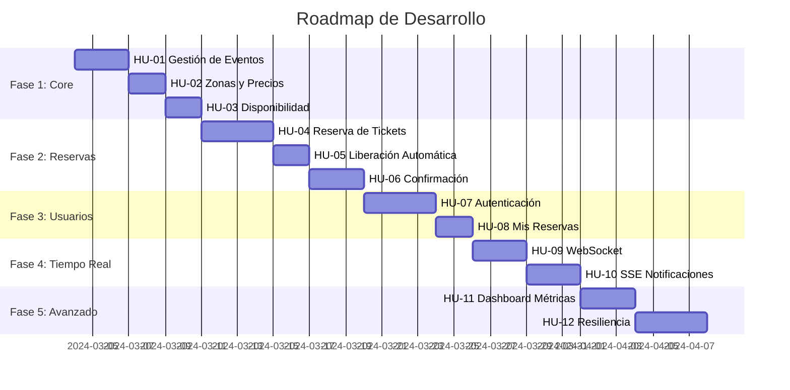
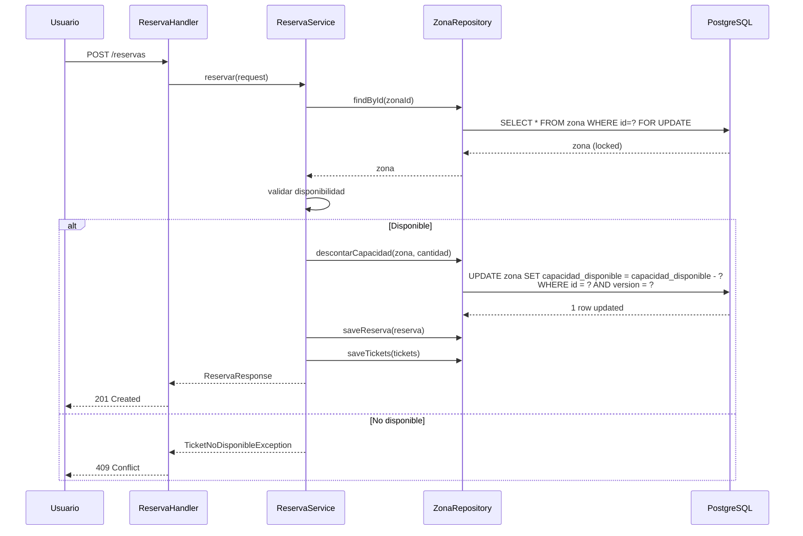
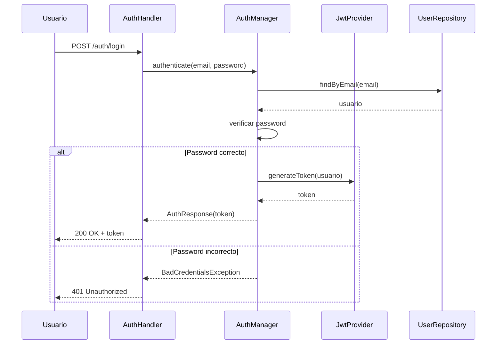
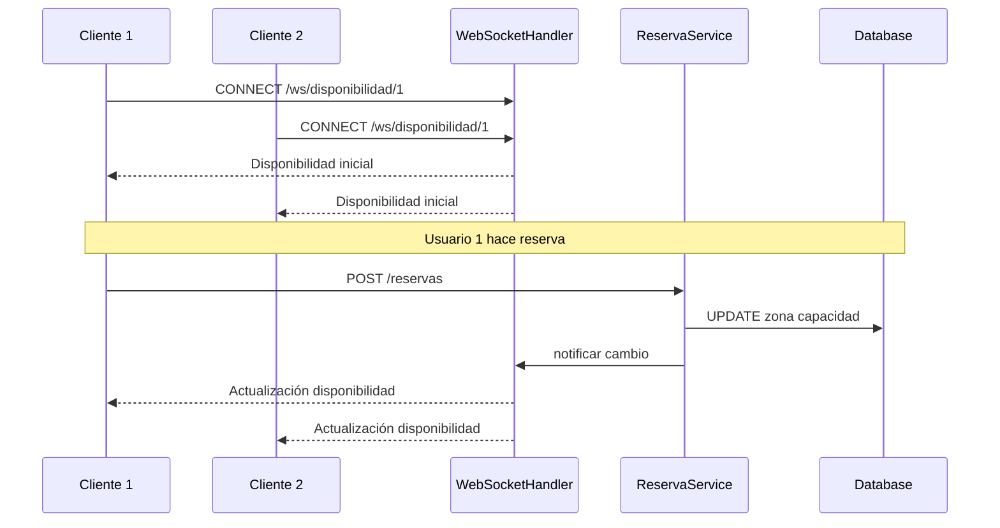

# 🎯 Historias de Usuario - Roadmap del Proyecto

## Visión General

El proyecto se desarrolla en 12 historias de usuario incrementales. Cada HU es funcional y entregable por sí misma, permitiendo validar el progreso en cada etapa.

## Progreso del Roadmap



---

## Fase 1: Core del Sistema

### HU-01: Gestión Básica de Eventos

**Como** administrador  
**Quiero** crear y listar eventos  
**Para** que los usuarios puedan ver qué eventos están disponibles

#### Criterios de Aceptación
- ✅ Crear evento con nombre, descripción, fecha, lugar, imagen
- ✅ Listar todos los eventos publicados
- ✅ Ver detalle de un evento específico
- ✅ Actualizar información de un evento
- ✅ Cambiar estado del evento (PUBLICADO, CANCELADO, FINALIZADO)
- ✅ Validaciones: fecha futura, campos obligatorios

#### Endpoints
```
POST   /api/v1/eventos
GET    /api/v1/eventos
GET    /api/v1/eventos/{id}
PUT    /api/v1/eventos/{id}
PATCH  /api/v1/eventos/{id}/estado
```

#### Entregable
CRUD básico de eventos (sin zonas aún) con arquitectura hexagonal completa

#### Archivos a Crear
- `domain/model/Evento.java`
- `domain/model/vo/EstadoEvento.java`
- `application/port/in/CrearEventoUseCase.java`
- `application/port/out/EventoRepository.java`
- `application/service/EventoService.java`
- `infrastructure/adapter/in/rest/handler/EventoHandler.java`
- `infrastructure/adapter/out/persistence/EventoRepositoryImpl.java`

---

### HU-02: Zonas y Precios

**Como** administrador  
**Quiero** definir zonas con diferentes precios y capacidades  
**Para** organizar la venta de tickets por sectores

#### Criterios de Aceptación
- ✅ Crear múltiples zonas por evento (VIP, Platea, General)
- ✅ Definir precio y capacidad por zona
- ✅ Listar zonas de un evento
- ✅ Actualizar precio o capacidad de una zona
- ✅ Eliminar zona (solo si no tiene reservas)
- ✅ Validaciones: capacidad > 0, precio > 0, nombre único por evento

#### Endpoints
```
POST   /api/v1/eventos/{eventoId}/zonas
GET    /api/v1/eventos/{eventoId}/zonas
PUT    /api/v1/zonas/{id}
DELETE /api/v1/zonas/{id}
```

#### Entregable
Gestión de zonas asociadas a eventos con relación uno-a-muchos

#### Archivos a Crear
- `domain/model/Zona.java`
- `application/port/in/GestionarZonasUseCase.java`
- `application/service/ZonaService.java`

---

### HU-03: Consulta de Disponibilidad en Tiempo Real

**Como** usuario  
**Quiero** ver la disponibilidad actual de tickets por zona  
**Para** decidir qué zona comprar

#### Criterios de Aceptación
- ✅ Endpoint que retorna disponibilidad por zona
- ✅ Mostrar capacidad total vs disponible
- ✅ Calcular porcentaje de ocupación
- ✅ Filtrar solo zonas con disponibilidad
- ✅ Caché con Redis (TTL 10 segundos)
- ✅ Invalidar caché al crear/confirmar reserva

#### Endpoints
```
GET /api/v1/eventos/{eventoId}/disponibilidad
GET /api/v1/zonas/{zonaId}/disponibilidad
```

#### Response Example
```json
{
  "eventoId": 1,
  "eventoNombre": "Concierto Rock",
  "zonas": [
    {
      "zonaId": 1,
      "nombre": "VIP",
      "precio": 150.00,
      "capacidadTotal": 100,
      "capacidadDisponible": 45,
      "porcentajeDisponible": 45.0
    }
  ]
}
```

#### Entregable
API de consulta de disponibilidad con caché Redis

#### Archivos a Crear
- `application/port/in/ConsultarDisponibilidadUseCase.java`
- `application/service/DisponibilidadService.java`
- `infrastructure/adapter/in/rest/handler/DisponibilidadHandler.java`
- `infrastructure/adapter/out/cache/RedisCacheAdapter.java`
- `infrastructure/config/RedisConfig.java`

---

## Fase 2: Sistema de Reservas

### HU-04: Reserva de Tickets (Sin Pago)

**Como** usuario  
**Quiero** reservar tickets temporalmente  
**Para** asegurar mi lugar mientras completo la compra

#### Criterios de Aceptación
- ✅ Reservar N tickets de una zona específica (máx 10)
- ✅ Generar código único de reserva (RES-YYYYMMDD-XXXXX)
- ✅ Reserva expira en 10 minutos
- ✅ Descontar de capacidad disponible atómicamente
- ✅ Validar disponibilidad antes de reservar
- ✅ Manejo de race conditions con optimistic locking
- ✅ Si 2 usuarios reservan el último ticket, solo uno tiene éxito
- ✅ Crear tickets en estado RESERVADO

#### Endpoints
```
POST /api/v1/reservas
GET  /api/v1/reservas/{codigo}
```

#### Request Example
```json
{
  "eventoId": 1,
  "zonaId": 2,
  "cantidadTickets": 3,
  "usuarioEmail": "user@example.com"
}
```

#### Flujo de Reserva


#### Entregable
Sistema de reservas temporales con control de concurrencia

#### Archivos a Crear
- `domain/model/Reserva.java`
- `domain/model/Ticket.java`
- `domain/model/vo/EstadoReserva.java`
- `domain/exception/TicketNoDisponibleException.java`
- `application/port/in/ReservarTicketUseCase.java`
- `application/service/ReservaService.java`
- `infrastructure/adapter/in/rest/handler/ReservaHandler.java`

---

### HU-05: Liberación Automática de Reservas Expiradas

**Como** sistema  
**Quiero** liberar automáticamente reservas no confirmadas  
**Para** que otros usuarios puedan comprar esos tickets

#### Criterios de Aceptación
- ✅ Scheduled task reactivo cada 1 minuto
- ✅ Buscar reservas PENDIENTES con fecha_expiracion < NOW()
- ✅ Cambiar estado a EXPIRADA
- ✅ Devolver tickets a capacidad disponible de la zona
- ✅ Actualizar estado de tickets a CANCELADO
- ✅ Publicar evento de dominio ReservaExpirada
- ✅ Transacción atómica (todo o nada)
- ✅ Logging de reservas expiradas

#### Implementación
```java
@Scheduled(fixedDelay = 60000) // Cada 1 minuto
public Mono<Void> liberarReservasExpiradas() {
    return reservaRepository.findExpiredReservations()
        .flatMap(this::expirarReserva)
        .doOnNext(r -> log.info("Reserva expirada: {}", r.getCodigo()))
        .then();
}
```

#### Entregable
Scheduler reactivo para expiración automática de reservas

#### Archivos a Crear
- `infrastructure/scheduler/ReservaExpirationScheduler.java`
- `infrastructure/config/SchedulerConfig.java`
- `domain/event/ReservaExpirada.java`

---

### HU-06: Confirmación de Reserva (Simulación de Pago)

**Como** usuario  
**Quiero** confirmar mi reserva  
**Para** obtener mis tickets definitivos

#### Criterios de Aceptación
- ✅ Confirmar reserva por código
- ✅ Validar que reserva esté en estado PENDIENTE
- ✅ Validar que no esté expirada
- ✅ Cambiar estado a CONFIRMADA/PAGADA
- ✅ Actualizar estado de tickets a VENDIDO
- ✅ Generar códigos QR para tickets
- ✅ Registrar pago (simulado por ahora)
- ✅ Publicar evento ReservaConfirmada
- ✅ Retornar tickets con códigos

#### Endpoints
```
POST /api/v1/reservas/{codigo}/confirmar
GET  /api/v1/reservas/{codigo}/tickets
```

#### Request Example
```json
{
  "metodoPago": "TARJETA_CREDITO",
  "transactionId": "TXN-123456"
}
```

#### Response Example
```json
{
  "reservaId": 1,
  "codigoReserva": "RES-20240304-ABC123",
  "estado": "CONFIRMADA",
  "tickets": [
    {
      "codigoTicket": "TKT-20240304-001",
      "zona": "VIP",
      "precio": 150.00,
      "qrCode": "data:image/png;base64,..."
    }
  ]
}
```

#### Entregable
Flujo completo: reserva → confirmación → tickets

#### Archivos a Crear
- `domain/model/Pago.java`
- `domain/model/vo/TipoPago.java`
- `domain/event/ReservaConfirmada.java`
- `application/port/in/ConfirmarReservaUseCase.java`
- `application/service/PagoService.java`

---

## Fase 3: Gestión de Usuarios

### HU-07: Gestión de Usuarios y Autenticación

**Como** usuario  
**Quiero** registrarme y autenticarme  
**Para** realizar reservas asociadas a mi cuenta

#### Criterios de Aceptación
- ✅ Registro con email, nombre, password
- ✅ Login con email/password
- ✅ Generación de JWT token
- ✅ Refresh token
- ✅ Roles: USER, ADMIN
- ✅ Endpoints protegidos por rol
- ✅ Password hasheado con BCrypt
- ✅ Validación de email único
- ✅ Validación de password fuerte

#### Endpoints
```
POST /api/v1/auth/register
POST /api/v1/auth/login
POST /api/v1/auth/refresh
GET  /api/v1/auth/me
```

#### Security Flow


#### Entregable
Sistema de autenticación completo con Spring Security Reactive

#### Archivos a Crear
- `domain/model/Usuario.java`
- `infrastructure/security/JwtTokenProvider.java`
- `infrastructure/security/SecurityContextRepository.java`
- `infrastructure/security/AuthenticationManager.java`
- `infrastructure/config/SecurityConfig.java`
- `infrastructure/adapter/in/rest/handler/AuthHandler.java`

---

### HU-08: Mis Reservas

**Como** usuario  
**Quiero** ver mis reservas activas y pasadas  
**Para** gestionar mis tickets

#### Criterios de Aceptación
- ✅ Listar reservas del usuario autenticado
- ✅ Filtrar por estado (PENDIENTE, CONFIRMADA, EXPIRADA)
- ✅ Ver detalle de reserva con tickets
- ✅ Cancelar reserva PENDIENTE
- ✅ Descargar tickets en PDF (opcional)
- ✅ Paginación de resultados
- ✅ Ordenar por fecha descendente

#### Endpoints
```
GET    /api/v1/usuarios/me/reservas
GET    /api/v1/usuarios/me/reservas/{id}
DELETE /api/v1/usuarios/me/reservas/{id}
```

#### Query Parameters
```
?estado=CONFIRMADA
?page=0&size=10
?sort=fechaReserva,desc
```

#### Entregable
Panel de usuario con historial de reservas

#### Archivos a Crear
- `application/port/in/ConsultarMisReservasUseCase.java`
- `application/port/in/CancelarReservaUseCase.java`

---

## Fase 4: Tiempo Real

### HU-09: WebSocket - Disponibilidad en Tiempo Real

**Como** usuario  
**Quiero** ver actualizaciones de disponibilidad sin refrescar  
**Para** saber al instante cuántos tickets quedan

#### Criterios de Aceptación
- ✅ WebSocket endpoint `/ws/disponibilidad/{eventoId}`
- ✅ Push de actualizaciones cuando cambia disponibilidad
- ✅ Mostrar capacidad disponible por zona en tiempo real
- ✅ Reconexión automática del cliente
- ✅ Heartbeat para mantener conexión
- ✅ Broadcast a todos los clientes conectados al evento

#### WebSocket Flow


#### Message Format
```json
{
  "type": "DISPONIBILIDAD_UPDATE",
  "eventoId": 1,
  "zonas": [
    {
      "zonaId": 1,
      "nombre": "VIP",
      "capacidadDisponible": 44
    }
  ],
  "timestamp": "2024-03-04T15:30:00Z"
}
```

#### Entregable
WebSocket reactivo con actualizaciones push

#### Archivos a Crear
- `infrastructure/adapter/in/websocket/DisponibilidadWebSocketHandler.java`
- `infrastructure/adapter/in/websocket/WebSocketConfig.java`
- `application/port/out/WebSocketNotifier.java`

---

### HU-10: Server-Sent Events - Notificaciones de Reserva

**Como** usuario  
**Quiero** recibir notificaciones de cambios en mis reservas  
**Para** estar informado en tiempo real

#### Criterios de Aceptación
- ✅ SSE endpoint `/sse/notificaciones/{usuarioId}`
- ✅ Notificar: reserva creada, confirmada, expirada, cancelada
- ✅ Stream de eventos por usuario
- ✅ Mantener conexión abierta
- ✅ Reconexión automática con Last-Event-ID
- ✅ Timeout de 30 minutos de inactividad

#### Event Types
```
- RESERVA_CREADA
- RESERVA_CONFIRMADA
- RESERVA_EXPIRADA
- RESERVA_CANCELADA
- EVENTO_PROXIMO (24h antes del evento)
```

#### SSE Message Format
```
event: RESERVA_CONFIRMADA
id: 12345
data: {"reservaId": 1, "codigo": "RES-20240304-ABC123", "mensaje": "Tu reserva ha sido confirmada"}

event: RESERVA_EXPIRADA
id: 12346
data: {"reservaId": 2, "codigo": "RES-20240304-XYZ789", "mensaje": "Tu reserva ha expirado"}
```

#### Entregable
Sistema de notificaciones con SSE

#### Archivos a Crear
- `infrastructure/adapter/in/rest/handler/NotificacionHandler.java`
- `application/port/out/NotificationService.java`
- `infrastructure/adapter/out/notification/NotificationServiceImpl.java`

---

## Fase 5: Avanzado

### HU-11: Dashboard de Métricas (Admin)

**Como** administrador  
**Quiero** ver métricas en tiempo real  
**Para** monitorear ventas y disponibilidad

#### Criterios de Aceptación
- ✅ Total de reservas por evento
- ✅ Ingresos totales y por evento
- ✅ Tasa de conversión (reservas → confirmadas)
- ✅ Eventos más populares
- ✅ Tickets vendidos vs disponibles
- ✅ Stream de métricas con SSE
- ✅ Filtros por fecha
- ✅ Exportar a CSV

#### Endpoints
```
GET /api/v1/admin/metricas/resumen
GET /api/v1/admin/metricas/eventos/{eventoId}
GET /api/v1/admin/metricas/stream (SSE)
```

#### Métricas Response
```json
{
  "totalReservas": 1250,
  "totalIngresos": 125000.00,
  "tasaConversion": 85.5,
  "eventosMasPopulares": [
    {
      "eventoId": 1,
      "nombre": "Concierto Rock",
      "ticketsVendidos": 450,
      "ingresos": 45000.00
    }
  ],
  "reservasPorEstado": {
    "PENDIENTE": 25,
    "CONFIRMADA": 1100,
    "EXPIRADA": 100,
    "CANCELADA": 25
  }
}
```

#### Entregable
Dashboard reactivo con métricas en tiempo real

#### Archivos a Crear
- `application/port/in/ConsultarMetricasUseCase.java`
- `application/service/MetricasService.java`
- `infrastructure/adapter/in/rest/handler/MetricasHandler.java`

---

### HU-12: Optimizaciones y Resiliencia

**Como** sistema  
**Quiero** manejar alta carga y fallos  
**Para** garantizar disponibilidad y performance

#### Criterios de Aceptación

**Circuit Breaker:**
- ✅ Circuit breaker para servicios externos (pago, email)
- ✅ Estados: CLOSED, OPEN, HALF_OPEN
- ✅ Fallback responses

**Rate Limiting:**
- ✅ Rate limiting por usuario (10 req/min)
- ✅ Rate limiting por IP (100 req/min)
- ✅ Rate limiting global (1000 req/min)
- ✅ Implementado con Redis

**Retry & Timeout:**
- ✅ Retry con backoff exponencial
- ✅ Timeouts configurables por operación
- ✅ Máximo 3 reintentos

**Logging & Monitoring:**
- ✅ Logging estructurado (JSON)
- ✅ Correlation IDs en todas las requests
- ✅ Métricas de performance (latencia, throughput)
- ✅ Health checks

**Caché Avanzado:**
- ✅ Caché multi-nivel (L1: local, L2: Redis)
- ✅ Cache warming para eventos populares
- ✅ Invalidación inteligente

#### Implementación Circuit Breaker
```java
@CircuitBreaker(name = "pagoService", fallbackMethod = "pagoFallback")
public Mono<PagoResponse> procesarPago(PagoRequest request) {
    return pagoGateway.procesar(request);
}

private Mono<PagoResponse> pagoFallback(PagoRequest request, Exception e) {
    log.error("Circuit breaker activado para pago", e);
    return Mono.just(PagoResponse.enCola());
}
```

#### Implementación Rate Limiting
```java
@RateLimiter(name = "reservaApi", fallbackMethod = "rateLimitFallback")
public Mono<ServerResponse> reservar(ServerRequest request) {
    // Lógica de reserva
}
```

#### Health Check Response
```json
{
  "status": "UP",
  "components": {
    "db": {
      "status": "UP",
      "details": {
        "database": "PostgreSQL",
        "validationQuery": "isValid()"
      }
    },
    "redis": {
      "status": "UP",
      "details": {
        "version": "7.0.0"
      }
    },
    "diskSpace": {
      "status": "UP",
      "details": {
        "total": 500000000000,
        "free": 250000000000
      }
    }
  }
}
```

#### Entregable
Sistema resiliente con patrones de tolerancia a fallos

#### Archivos a Crear
- `infrastructure/config/ResilienceConfig.java`
- `infrastructure/adapter/in/rest/filter/RateLimitFilter.java`
- `infrastructure/adapter/in/rest/filter/CorrelationIdFilter.java`
- `application/port/out/CircuitBreakerService.java`

---

## Resumen de Entregables por Fase

### Fase 1: Core (7 días)
- ✅ CRUD de eventos
- ✅ Gestión de zonas
- ✅ Consulta de disponibilidad con caché

### Fase 2: Reservas (9 días)
- ✅ Sistema de reservas con concurrencia
- ✅ Expiración automática
- ✅ Confirmación y generación de tickets

### Fase 3: Usuarios (6 días)
- ✅ Autenticación JWT
- ✅ Panel de usuario

### Fase 4: Tiempo Real (6 días)
- ✅ WebSocket para disponibilidad
- ✅ SSE para notificaciones

### Fase 5: Avanzado (7 días)
- ✅ Dashboard de métricas
- ✅ Resiliencia y optimizaciones

**Total estimado: 35 días de desarrollo**

---

## Criterios de Éxito del Proyecto

### Funcionales
- ✅ Sistema maneja 1000 reservas simultáneas sin overselling
- ✅ Reservas expiran automáticamente en 10 minutos
- ✅ Actualizaciones en tiempo real funcionan con 100+ clientes conectados
- ✅ Autenticación segura con JWT

### No Funcionales
- ✅ Tiempo de respuesta < 200ms (p95)
- ✅ Disponibilidad > 99.9%
- ✅ Cobertura de tests > 80%
- ✅ Zero overselling bajo carga

### Técnicos
- ✅ Arquitectura hexagonal bien implementada
- ✅ Código reactivo sin bloqueos
- ✅ Manejo correcto de backpressure
- ✅ Logging y monitoreo completo
