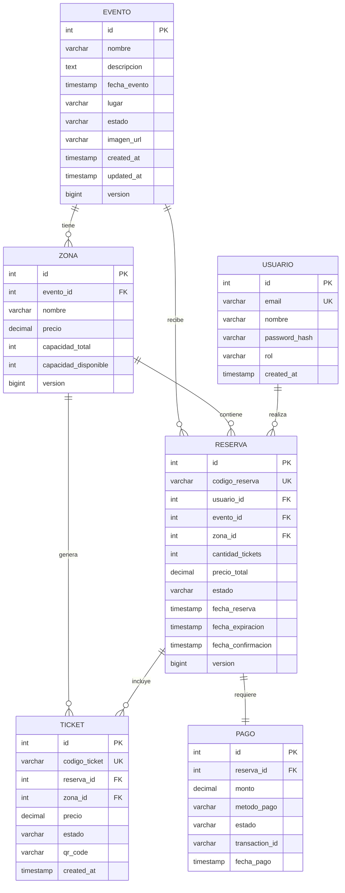

# 🗄️ Modelo de Datos

## Diagrama Entidad-Relación



## Esquema SQL Completo

### Tabla: evento

```sql
CREATE TABLE evento (
    id SERIAL PRIMARY KEY,
    nombre VARCHAR(200) NOT NULL,
    descripcion TEXT,
    fecha_evento TIMESTAMP NOT NULL,
    lugar VARCHAR(200) NOT NULL,
    estado VARCHAR(20) NOT NULL CHECK (estado IN ('PUBLICADO', 'AGOTADO', 'CANCELADO', 'FINALIZADO')),
    imagen_url VARCHAR(500),
    created_at TIMESTAMP DEFAULT NOW(),
    updated_at TIMESTAMP DEFAULT NOW(),
    version BIGINT DEFAULT 0
);

-- Índices
CREATE INDEX idx_evento_fecha ON evento(fecha_evento);
CREATE INDEX idx_evento_estado ON evento(estado);
CREATE INDEX idx_evento_fecha_estado ON evento(fecha_evento, estado);

-- Comentarios
COMMENT ON TABLE evento IS 'Eventos disponibles para reserva de tickets';
COMMENT ON COLUMN evento.estado IS 'PUBLICADO: visible para usuarios | AGOTADO: sin tickets | CANCELADO: evento cancelado | FINALIZADO: evento pasado';
COMMENT ON COLUMN evento.version IS 'Control de concurrencia optimista';
```

### Tabla: zona

```sql
CREATE TABLE zona (
    id SERIAL PRIMARY KEY,
    evento_id INT NOT NULL REFERENCES evento(id) ON DELETE CASCADE,
    nombre VARCHAR(100) NOT NULL,
    precio DECIMAL(10,2) NOT NULL CHECK (precio > 0),
    capacidad_total INT NOT NULL CHECK (capacidad_total > 0),
    capacidad_disponible INT NOT NULL CHECK (capacidad_disponible >= 0),
    version BIGINT DEFAULT 0,
    CONSTRAINT check_capacidad CHECK (capacidad_disponible <= capacidad_total),
    CONSTRAINT unique_zona_evento UNIQUE (evento_id, nombre)
);

-- Índices
CREATE INDEX idx_zona_evento ON zona(evento_id);
CREATE INDEX idx_zona_disponibilidad ON zona(capacidad_disponible) WHERE capacidad_disponible > 0;

-- Comentarios
COMMENT ON TABLE zona IS 'Zonas de un evento con precios y capacidades diferentes';
COMMENT ON COLUMN zona.capacidad_disponible IS 'Actualizada atómicamente en cada reserva';
COMMENT ON COLUMN zona.version IS 'Control de concurrencia optimista para evitar overselling';
```

### Tabla: usuario

```sql
CREATE TABLE usuario (
    id SERIAL PRIMARY KEY,
    email VARCHAR(200) UNIQUE NOT NULL,
    nombre VARCHAR(200) NOT NULL,
    password_hash VARCHAR(255) NOT NULL,
    rol VARCHAR(20) NOT NULL CHECK (rol IN ('USER', 'ADMIN')) DEFAULT 'USER',
    created_at TIMESTAMP DEFAULT NOW()
);

-- Índices
CREATE UNIQUE INDEX idx_usuario_email ON usuario(LOWER(email));
CREATE INDEX idx_usuario_rol ON usuario(rol);

-- Comentarios
COMMENT ON TABLE usuario IS 'Usuarios del sistema';
COMMENT ON COLUMN usuario.password_hash IS 'Hash BCrypt del password';
COMMENT ON COLUMN usuario.rol IS 'USER: usuario normal | ADMIN: administrador del sistema';
```

### Tabla: reserva

```sql
CREATE TABLE reserva (
    id SERIAL PRIMARY KEY,
    codigo_reserva VARCHAR(50) UNIQUE NOT NULL,
    usuario_id INT NOT NULL REFERENCES usuario(id),
    evento_id INT NOT NULL REFERENCES evento(id),
    zona_id INT NOT NULL REFERENCES zona(id),
    cantidad_tickets INT NOT NULL CHECK (cantidad_tickets > 0 AND cantidad_tickets <= 10),
    precio_total DECIMAL(10,2) NOT NULL CHECK (precio_total > 0),
    estado VARCHAR(20) NOT NULL CHECK (estado IN ('PENDIENTE', 'CONFIRMADA', 'PAGADA', 'CANCELADA', 'EXPIRADA')),
    fecha_reserva TIMESTAMP DEFAULT NOW(),
    fecha_expiracion TIMESTAMP NOT NULL,
    fecha_confirmacion TIMESTAMP,
    version BIGINT DEFAULT 0
);

-- Índices
CREATE UNIQUE INDEX idx_reserva_codigo ON reserva(codigo_reserva);
CREATE INDEX idx_reserva_usuario ON reserva(usuario_id);
CREATE INDEX idx_reserva_evento ON reserva(evento_id);
CREATE INDEX idx_reserva_estado ON reserva(estado);
CREATE INDEX idx_reserva_expiracion ON reserva(fecha_expiracion) WHERE estado = 'PENDIENTE';
CREATE INDEX idx_reserva_usuario_estado ON reserva(usuario_id, estado);

-- Comentarios
COMMENT ON TABLE reserva IS 'Reservas de tickets realizadas por usuarios';
COMMENT ON COLUMN reserva.codigo_reserva IS 'Código único generado (ej: RES-20240304-ABC123)';
COMMENT ON COLUMN reserva.estado IS 'PENDIENTE: esperando pago | CONFIRMADA: pago procesado | PAGADA: igual a confirmada | CANCELADA: cancelada por usuario | EXPIRADA: tiempo límite superado';
COMMENT ON COLUMN reserva.fecha_expiracion IS 'Reserva expira en 10 minutos si no se confirma';
COMMENT ON COLUMN reserva.cantidad_tickets IS 'Máximo 10 tickets por reserva';
```

### Tabla: ticket

```sql
CREATE TABLE ticket (
    id SERIAL PRIMARY KEY,
    codigo_ticket VARCHAR(50) UNIQUE NOT NULL,
    reserva_id INT NOT NULL REFERENCES reserva(id) ON DELETE CASCADE,
    zona_id INT NOT NULL REFERENCES zona(id),
    precio DECIMAL(10,2) NOT NULL CHECK (precio > 0),
    estado VARCHAR(20) NOT NULL CHECK (estado IN ('RESERVADO', 'VENDIDO', 'USADO', 'CANCELADO')),
    qr_code VARCHAR(500),
    created_at TIMESTAMP DEFAULT NOW()
);

-- Índices
CREATE UNIQUE INDEX idx_ticket_codigo ON ticket(codigo_ticket);
CREATE INDEX idx_ticket_reserva ON ticket(reserva_id);
CREATE INDEX idx_ticket_estado ON ticket(estado);

-- Comentarios
COMMENT ON TABLE ticket IS 'Tickets individuales generados por reserva';
COMMENT ON COLUMN ticket.codigo_ticket IS 'Código único del ticket (ej: TKT-20240304-XYZ789)';
COMMENT ON COLUMN ticket.estado IS 'RESERVADO: reserva pendiente | VENDIDO: reserva confirmada | USADO: ticket escaneado en evento | CANCELADO: reserva cancelada';
COMMENT ON COLUMN ticket.qr_code IS 'Código QR para validación en el evento';
```

### Tabla: pago

```sql
CREATE TABLE pago (
    id SERIAL PRIMARY KEY,
    reserva_id INT NOT NULL REFERENCES reserva(id),
    monto DECIMAL(10,2) NOT NULL CHECK (monto > 0),
    metodo_pago VARCHAR(50) NOT NULL,
    estado VARCHAR(20) NOT NULL CHECK (estado IN ('PENDIENTE', 'COMPLETADO', 'FALLIDO', 'REEMBOLSADO')),
    transaction_id VARCHAR(200),
    fecha_pago TIMESTAMP DEFAULT NOW()
);

-- Índices
CREATE INDEX idx_pago_reserva ON pago(reserva_id);
CREATE INDEX idx_pago_estado ON pago(estado);
CREATE INDEX idx_pago_transaction ON pago(transaction_id);

-- Comentarios
COMMENT ON TABLE pago IS 'Registro de pagos de reservas';
COMMENT ON COLUMN pago.metodo_pago IS 'TARJETA_CREDITO, TARJETA_DEBITO, TRANSFERENCIA, etc.';
COMMENT ON COLUMN pago.transaction_id IS 'ID de transacción del gateway de pago';
```

## Constraints y Reglas de Negocio

### Integridad Referencial

```sql
-- Cascada en eliminación de evento
ALTER TABLE zona ADD CONSTRAINT fk_zona_evento 
    FOREIGN KEY (evento_id) REFERENCES evento(id) ON DELETE CASCADE;

-- Cascada en eliminación de reserva
ALTER TABLE ticket ADD CONSTRAINT fk_ticket_reserva 
    FOREIGN KEY (reserva_id) REFERENCES reserva(id) ON DELETE CASCADE;

-- Restricción en eliminación de usuario (no permitir si tiene reservas activas)
ALTER TABLE reserva ADD CONSTRAINT fk_reserva_usuario 
    FOREIGN KEY (usuario_id) REFERENCES usuario(id) ON DELETE RESTRICT;
```

### Triggers para Auditoría

```sql
-- Actualizar updated_at en evento
CREATE OR REPLACE FUNCTION update_evento_timestamp()
RETURNS TRIGGER AS $$
BEGIN
    NEW.updated_at = NOW();
    RETURN NEW;
END;
$$ LANGUAGE plpgsql;

CREATE TRIGGER trigger_evento_updated_at
    BEFORE UPDATE ON evento
    FOR EACH ROW
    EXECUTE FUNCTION update_evento_timestamp();
```

### Triggers para Lógica de Negocio

```sql
-- Actualizar estado de evento a AGOTADO cuando todas las zonas estén llenas
CREATE OR REPLACE FUNCTION check_evento_agotado()
RETURNS TRIGGER AS $$
BEGIN
    IF (SELECT SUM(capacidad_disponible) FROM zona WHERE evento_id = NEW.evento_id) = 0 THEN
        UPDATE evento SET estado = 'AGOTADO' WHERE id = NEW.evento_id;
    END IF;
    RETURN NEW;
END;
$$ LANGUAGE plpgsql;

CREATE TRIGGER trigger_check_agotado
    AFTER UPDATE ON zona
    FOR EACH ROW
    WHEN (OLD.capacidad_disponible <> NEW.capacidad_disponible)
    EXECUTE FUNCTION check_evento_agotado();
```

## Estrategia de Versionado (Optimistic Locking)

```sql
-- Ejemplo de actualización con control de versión
UPDATE zona 
SET capacidad_disponible = capacidad_disponible - :cantidad,
    version = version + 1
WHERE id = :zonaId 
  AND version = :expectedVersion
  AND capacidad_disponible >= :cantidad;

-- Si no se actualiza ninguna fila, hay conflicto de concurrencia
```

## Datos de Ejemplo

```sql
-- Insertar evento de ejemplo
INSERT INTO evento (nombre, descripcion, fecha_evento, lugar, estado) VALUES
('Concierto Rock Nacional', 'Gran concierto con las mejores bandas', '2024-06-15 20:00:00', 'Estadio Nacional', 'PUBLICADO');

-- Insertar zonas
INSERT INTO zona (evento_id, nombre, precio, capacidad_total, capacidad_disponible) VALUES
(1, 'VIP', 150.00, 100, 100),
(1, 'Platea', 80.00, 500, 500),
(1, 'General', 40.00, 2000, 2000);

-- Insertar usuario de prueba
INSERT INTO usuario (email, nombre, password_hash, rol) VALUES
('admin@example.com', 'Admin', '$2a$10$...', 'ADMIN'),
('user@example.com', 'Usuario Test', '$2a$10$...', 'USER');
```

## Consultas Comunes

### Disponibilidad por evento

```sql
SELECT 
    e.id,
    e.nombre,
    z.nombre as zona,
    z.precio,
    z.capacidad_disponible,
    z.capacidad_total,
    ROUND((z.capacidad_disponible::decimal / z.capacidad_total) * 100, 2) as porcentaje_disponible
FROM evento e
JOIN zona z ON e.id = z.evento_id
WHERE e.estado = 'PUBLICADO'
  AND z.capacidad_disponible > 0
ORDER BY e.fecha_evento, z.precio DESC;
```

### Reservas activas de un usuario

```sql
SELECT 
    r.codigo_reserva,
    e.nombre as evento,
    z.nombre as zona,
    r.cantidad_tickets,
    r.precio_total,
    r.estado,
    r.fecha_expiracion
FROM reserva r
JOIN evento e ON r.evento_id = e.id
JOIN zona z ON r.zona_id = z.id
WHERE r.usuario_id = :usuarioId
  AND r.estado IN ('PENDIENTE', 'CONFIRMADA', 'PAGADA')
ORDER BY r.fecha_reserva DESC;
```

### Reservas expiradas para liberar

```sql
SELECT id, zona_id, cantidad_tickets
FROM reserva
WHERE estado = 'PENDIENTE'
  AND fecha_expiracion < NOW();
```

### Métricas de ventas por evento

```sql
SELECT 
    e.nombre,
    COUNT(DISTINCT r.id) as total_reservas,
    SUM(r.cantidad_tickets) as tickets_vendidos,
    SUM(r.precio_total) as ingresos_totales,
    ROUND(AVG(r.cantidad_tickets), 2) as promedio_tickets_por_reserva
FROM evento e
LEFT JOIN reserva r ON e.id = r.evento_id AND r.estado IN ('CONFIRMADA', 'PAGADA')
GROUP BY e.id, e.nombre
ORDER BY ingresos_totales DESC;
```

## Consideraciones de Performance

### Índices Críticos
- `idx_reserva_expiracion`: Para el scheduler de expiración
- `idx_zona_disponibilidad`: Para consultas de disponibilidad
- `idx_reserva_usuario_estado`: Para "Mis Reservas"

### Particionamiento (Futuro)
Para escalar, considerar particionar `reserva` y `ticket` por fecha:
```sql
-- Ejemplo de particionamiento por rango de fechas
CREATE TABLE reserva_2024_q1 PARTITION OF reserva
    FOR VALUES FROM ('2024-01-01') TO ('2024-04-01');
```

### Caché
- Disponibilidad de zonas: TTL 10 segundos
- Detalle de eventos: TTL 5 minutos
- Lista de eventos: TTL 1 minuto
